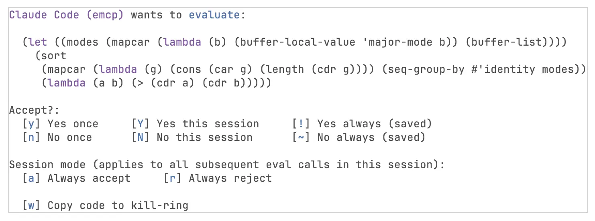

#+title: EMCP - Lets your agent talk to Emacs
#+author: Marten Lienen

EMCP lets your LLM agent interact with Emacs. The agent can look up documentation and definitions, take screenshots, read buffers, execute code and more. Exactly which [[#built-in-prompts][prompts]], [[#built-in-resources][resources]] and [[#built-in-tools][tools]] are available to the agent depends on the active [[#profiles][profile]].

As an MCP implementation, EMCP supports all the core server features from the [[https://modelcontextprotocol.io/specification/2025-11-25/server][2025-11-25 version of the MCP specification]] and even has (as of yet unused) facilities for server-to-client notifications and requests.

I am adding tools etc. to the project as I need them and find a usable design for them. If there is a tool missing which you really want /right now/, EMCP has been designed to be extensible and adding it yourself should be easy and even fun. Just [[#custom-components][follow the instructions]] or hand them to your agent.

* Installation

You can install EMCP from MELPA, for example =use-package= with [[https://github.com/progfolio/elpaca][elpaca]] would be
#+begin_src emacs-lisp
  (use-package emcp
    :ensure t)
#+end_src

Alternatively, you can use the recipe =(emcp :fetcher git :url "https://codeberg.org/martenlienen/emcp")= to install directly from the repository, for example with ~package-vc-install~.

** Client Setup

*** [[https://github.com/xenodium/agent-shell][agent-shell]]

To use EMCP in agent-shell, add it to ~agent-shell-mcp-servers~ as follows

#+begin_src emacs-lisp
  (add-to-list 'agent-shell-mcp-servers
               '((name . "emcp")
                 (type . "http")
                 (headers . ())
                 (url . (lambda ()
                          (require 'emcp)
                          (let ((server (emcp-start emcp-default-profile)))
                            (emcp-server-url server))))))
#+end_src

If ~emcp-default-profile~ is nil, you can choose a different profile for each session interactively. EMCP takes care to start at most one server per profile.

*** Non-Emacs clients like Claude Code, Codex, etc.

To use EMCP in non-Emacs clients, set ~emcp-http-port~ to a number of your choice to start the server at a deterministic address, for example

#+begin_src emacs-lisp
  (setq emcp-http-port 38913)
#+end_src

Then start EMCP with =M-x emcp-start= and register the server with your client, for example =claude mcp add --transport http emcp http://127.0.0.1:38913/mcp=.

* Usage

The agent-shell setup above is the preferred way to use EMCP and does not require any other commands.

For other cases, call ~emcp-start~ interactively, which asks for a profile and places the server URL on the kill-ring. ~emcp-stop~, ~emcp-restart~ and ~emcp-reload~ do what you would expect them to do and are useful when you develop [[#custom-components][your own MCP components]] or custom profiles.

** Safety

Tools that allow agents to execute arbitrary code, e.g. through code evaluation or sending key presses, will by default display a confirmation buffer to the user. In this buffer, the user can inspect the code or key presses and accept or reject the execution.

#+caption: A confirmation dialog to verify code before execution

* Profiles
:PROPERTIES:
:CUSTOM_ID: profiles
:END:

Profiles let you mix and match agent abilities for different sessions, so that you can choose which agent can execute code and which can only look up function definitions.

~emcp-default-profile~ lets you choose a default profile by setting it to one of the alist keys of ~emcp-profiles~. Its default nil means to always ask interactively. If ~emcp-default-profile~ is non-nil, you can still choose a profile by calling ~emcp-start~ with =C-u= prefix argument.

~emcp-profiles~ is an alist of ~(NAME . PROFILE)~ pairs where ~NAME~ is a symbol and ~PROFILE~ is a profile plist. Available properties of profile plists are hopefully self-explanatory from the following example.
#+begin_src emacs-lisp
  (add-to-list 'emcp-profiles
               '(example . ( :description "An example profile."
                             :include (my-other-profile
                                       inspect)
                             :prompts (emcp-prompt-screenshot
                                       my-prompt)
                             :resources (emcp-resource-info-node
                                         my-resource)
                             :tools (emcp-tools-apropos
                                     my-own-tool))))
#+end_src

See below to learn how to define your own [[#custom-prompts][prompts]], [[#custom-resources][resources]] and [[#custom-tools][tools]]. If you want to share them with the Emacs community, please open a pull request.

#+begin_src emacs-lisp :results none :exports none
  (defun emcp--doc-id (sym)
    (cond
     ((get sym 'emcp-prompt) (concat "prompt-" (plist-get (get sym 'emcp-prompt) :name)))
     ((get sym 'emcp-tool) (concat "tool-" (plist-get (get sym 'emcp-tool) :name)))
     (t (let* ((r (or (get sym 'emcp-resource) (get sym 'emcp-resource-template)))
               (meta (plist-get r :metadata)))
          (concat "resource-" (alist-get 'name meta))))))

  (defun emcp--doc-display-name (sym)
    (cond
     ((get sym 'emcp-prompt) (concat "/" (plist-get (get sym 'emcp-prompt) :name)))
     ((get sym 'emcp-tool) (plist-get (get sym 'emcp-tool) :name))
     (t (let* ((r (or (get sym 'emcp-resource) (get sym 'emcp-resource-template)))
               (meta (plist-get r :metadata)))
          (or (alist-get 'uriTemplate meta) (alist-get 'uri meta))))))

  (defun emcp--doc-format-link (sym)
    (format "- [[#%s][=%s=]]" (emcp--doc-id sym) (emcp--doc-display-name sym)))

  (defun emcp--doc-source-line (sym)
    "Return the 1-based line where SYM's `emcp-def*' form starts.

`find-function-search-for-symbol' is unsuitable here because its
default regex matches any `(def... SYM' form, so for symbols that also
have a `(defgroup SYM ...)' it lands on the defgroup, not the
`emcp-def*' macro call we want to link to."
    (let* ((file-path (symbol-file sym 'defun))
           (macro (cond ((get sym 'emcp-tool) "emcp-deftool")
                        ((get sym 'emcp-prompt) "emcp-defprompt")
                        ((or (get sym 'emcp-resource)
                             (get sym 'emcp-resource-template))
                         "emcp-defresource"))))
      (with-temp-buffer
        (insert-file-contents file-path)
        (goto-char (point-min))
        (re-search-forward
         (format "^(%s %s[ \n]"
                 (regexp-quote macro)
                 (regexp-quote (symbol-name sym))))
        (line-number-at-pos (match-beginning 0)))))

  (defun emcp--doc-source-target (sym)
    "Return the org-link target for SYM's source location.

Uses the `./FILE::LINE' relative-path form (no `file:' prefix), which
org-mode treats as a file link with line target and which forge org
renderers tend to accept as a relative URL."
    (format "./%s::%d"
            (file-name-nondirectory (symbol-file sym 'defun))
            (emcp--doc-source-line sym)))

  (cl-flet ((format-profile (entry)
              (let* ((name (car entry))
                     (profile (cdr entry))
                     (desc (plist-get profile :description))
                     (includes (plist-get profile :include))
                     (prompts (plist-get profile :prompts))
                     (resources (plist-get profile :resources))
                     (tools (plist-get profile :tools))
                     (lines (list (format "** =%s=" name)
                                  ":PROPERTIES:"
                                  (format ":CUSTOM_ID: profile-%s" name)
                                  ":END:"
                                  ""
                                  desc)))
                (when includes
                  (nconc lines (list ""
                                     (format "Includes: %s."
                                             (mapconcat (lambda (p) (format "[[#profile-%s][=%s=]]" p p))
                                                        includes ", ")))))
                (when prompts
                  (nconc lines (list "" "Prompts:"))
                  (dolist (sym prompts)
                    (nconc lines (list (emcp--doc-format-link sym)))))
                (when resources
                  (nconc lines (list "" "Resources:"))
                  (dolist (sym resources)
                    (nconc lines (list (emcp--doc-format-link sym)))))
                (when tools
                  (nconc lines (list "" "Tools:"))
                  (dolist (sym tools)
                    (nconc lines (list (emcp--doc-format-link sym)))))
                (string-join lines "\n"))))
    (let ((content (mapconcat #'format-profile emcp-profiles "\n\n")))
      (save-excursion
        (goto-char (point-min))
        (let ((beg (and (search-forward "# begin:profiles\n" nil t) (point)))
              (end (and (search-forward "# end:profiles" nil t)
                        (match-beginning 0))))
          (when (and beg end)
            (delete-region beg end)
            (goto-char beg)
            (insert content "\n"))))))
#+end_src

# begin:profiles
** =inspect=
:PROPERTIES:
:CUSTOM_ID: profile-inspect
:END:

Ask Emacs about itself (docs, definitions, info pages).

Lets the agent search through symbols and look up their doc strings and
definitions. The agent can also search and read info pages.

The =/screenshot= prompt lets the user share a screenshot of all current
Emacs frames with the agent, without the agent being able to request
screenshots at will.

Prompts:
- [[#prompt-screenshot][=/screenshot=]]

Resources:
- [[#resource-info-node][=info://{manual}/{node}=]]

Tools:
- [[#tool-apropos][=apropos=]]
- [[#tool-describe][=describe=]]
- [[#tool-find-definition][=find-definition=]]
- [[#tool-find-references][=find-references=]]
- [[#tool-info-search][=info-search=]]

** =develop=
:PROPERTIES:
:CUSTOM_ID: profile-develop
:END:

Capabilities for developing Emacs lisp.

This gives the agent additional capabilities to work with Emacs and
inspect its current state like:
1. Taking screenshots
2. Reading and setting variables

Includes: [[#profile-inspect][=inspect=]].

Tools:
- [[#tool-get-variable][=get-variable=]]
- [[#tool-set-variable][=set-variable=]]
- [[#tool-screenshot][=screenshot=]]

** =full-control=
:PROPERTIES:
:CUSTOM_ID: profile-full-control
:END:

Full control over Emacs.

Adds tools to evaluate arbitrary Emacs Lisp and to send arbitrary key
sequences.  Both are gated by user confirmation.

Includes: [[#profile-inspect][=inspect=]], [[#profile-develop][=develop=]].

Tools:
- [[#tool-eval][=eval=]]
- [[#tool-send-keys][=send-keys=]]
# end:profiles

* Custom MCP Components
:PROPERTIES:
:CUSTOM_ID: custom-components
:END:

Define your own prompts, resources and tools with the macros below, then add them to a profile in ~emcp-profiles~ to make them available to clients. For a complete description of the output format for your components, consult the [[https://modelcontextprotocol.io/specification/2025-11-25/server][MCP specification]].

** Prompts
:PROPERTIES:
:CUSTOM_ID: custom-prompts
:END:

~emcp-defprompt~ defines an MCP prompt. A prompt generates a list of messages that are injected into the conversation when the user invokes it.

#+begin_src emacs-lisp
  (emcp-defprompt my-prompt-review-buffer
      ((buffer "Name of the buffer to review" :default nil))
    "Review the contents of an Emacs buffer."
    :name "review-buffer"
    (let* ((buf (or (and buffer (get-buffer buffer))
                    (current-buffer)))
           (text (with-current-buffer buf
                   (buffer-substring-no-properties (point-min) (point-max)))))
      `((messages . [((role . "user")
                      (content . ((type . "text")
                                  (text . ,(format "Review this code:\n\n%s" text)))))]))))
#+end_src

Arguments are either bare symbols (required) or lists with an optional description and ~:default~ (making them optional in MCP). The prompt body returns a ~prompts/get~ result alist.

For asynchronous prompts that need to call back later (e.g. after user confirmation), pass ~:async t~. This binds ~send-result~ and ~send-error~ in the body instead of using the return value:

#+begin_src emacs-lisp
  (emcp-defprompt my-prompt-confirm ()
    "Ask the user for confirmation before proceeding."
    :name "confirm"
    :async t
    (if (y-or-n-p "Proceed? ")
        (send-result '((messages . [((role . "user")
                                     (content . ((type . "text")
                                                 (text . "User confirmed."))))])))
      (send-error -1 "User declined")))
#+end_src

Keyword options:
- ~:name~ :: Name for the prompt, usually used as the slash command. Defaults to the symbol name (~my-prompt-confirm~).
- ~:title~ :: More descriptive title for humans.
- ~:description~ :: Defaults to the docstring.
- ~:async~ :: When non-nil, bind ~send-result~ and ~send-error~ in the body instead of using the return value.

~server~ and ~session~ are bound in the body for access to the MCP server state.

** Resources & Resource Templates
:PROPERTIES:
:CUSTOM_ID: custom-resources
:END:

~emcp-defresource~ defines an MCP resource. If the URI contains ~{param}~ placeholders (RFC 6570), it becomes a resource template; otherwise it is a static resource. Template parameters are automatically extracted and bound in the body.

#+begin_src emacs-lisp
  ;; Static resource
  (emcp-defresource my-resource-scratch "emacs://buffer/*scratch*"
    "Read the *scratch* buffer."
    :name "scratch"
    :mime-type "text/plain"
    (let ((text (with-current-buffer "*scratch*"
                  (buffer-substring-no-properties (point-min) (point-max)))))
      `((contents . [((uri . ,uri)
                      (mimeType . "text/plain")
                      (text . ,text))]))))

  ;; Resource template - `name' is bound automatically from {name} in the URI
  (emcp-defresource my-resource-buffer "emacs://buffer/{name}"
    "Read a buffer by name."
    :name "buffer"
    :mime-type "text/plain"
    (if-let* ((buf (get-buffer name)))
        (let ((text (with-current-buffer buf
                      (buffer-substring-no-properties (point-min) (point-max)))))
          `((contents . [((uri . ,uri)
                          (mimeType . "text/plain")
                          (text . ,text))])))
      (error "Buffer %s does not exist" name)))
#+end_src

The resource body returns a ~resources/read~ result alist. In addition to template parameters, ~server~, ~session~ and ~uri~ (the full request URI) are bound.

For asynchronous resources (e.g. fetching content over the network), pass ~:async t~. This binds ~send-result~ and ~send-error~ in the body instead of using the return value:

#+begin_src emacs-lisp
  (emcp-defresource my-resource-url "https://{host}/{path}"
    "Fetch a URL."
    :name "url"
    :mime-type "text/html"
    :async t
    (url-retrieve (format "https://%s/%s" host path)
                  (lambda (_status)
                    (goto-char url-http-end-of-headers)
                    (send-result
                     `((contents . [((uri . ,uri)
                                     (mimeType . "text/html")
                                     (text . ,(buffer-substring-no-properties
                                               (point) (point-max))))]))))))
#+end_src

Keyword options:
- ~:name~ :: MCP resource name. Defaults to the elisp symbol name (~my-resource-scratch~ above). Mostly an irrelevant detail of the MCP protocol for resources.
- ~:title~ :: Human-readable title.
- ~:description~ :: MCP description. Defaults to the docstring.
- ~:mime-type~ :: MIME type of the resource content.
- ~:async~ :: When non-nil, bind ~send-result~ and ~send-error~ in the body instead of using the return value.

** Tools
:PROPERTIES:
:CUSTOM_ID: custom-tools
:END:

~emcp-deftool~ defines an MCP tool. Tools are functions that the agent can call to perform actions or retrieve information.

#+begin_src emacs-lisp
  (emcp-deftool my-tool-list-buffers ()
    "List all open buffers with their file paths and major modes."
    :name "list-buffers"
    (let ((lines (mapcar (lambda (buf)
                           (format "%s\t%s\t%s"
                                   (buffer-name buf)
                                   (or (buffer-file-name buf) "")
                                   (buffer-local-value 'major-mode buf)))
                         (buffer-list))))
      `((content . [((type . "text")
                     (text . ,(string-join lines "\n")))]))))
#+end_src

Tool arguments support ~:type~ (a JSON schema type; defaults to ~"string"~) and ~:default~ (making the argument optional):

#+begin_src emacs-lisp
  (emcp-deftool my-tool-calc
      ((expression "Algebraic expression to evaluate, e.g. =sqrt(2*pi)=.")
       (precision "Number of significant digits in the result." :type "integer" :default 12))
    "Evaluate an algebraic expression with calc."
    :name "calc"
    (let ((calc-internal-prec precision))
      `((content . [((type . "text")
                     (text . ,(calc-eval expression)))]))))
#+end_src

For asynchronous tools (e.g. waiting for a process or network response), pass ~:async t~. This binds ~send-result~ and ~send-error~ instead of using the return value:

#+begin_src emacs-lisp
  (emcp-deftool my-tool-shell
      ((command "Shell command to run"))
    "Run a shell command asynchronously."
    :name "shell"
    :async t
    (let ((buf (generate-new-buffer " *emcp-shell*")))
      (set-process-sentinel
       (start-process-shell-command "emcp-shell" buf command)
       (lambda (proc _event)
         (let ((output (with-current-buffer (process-buffer proc)
                         (buffer-string))))
           (kill-buffer (process-buffer proc))
           (if (zerop (process-exit-status proc))
               (send-result `((content . [((type . "text") (text . ,output))])))
             (send-error -1 (format "Exit %d" (process-exit-status proc))
                         `((output . ,output)))))))))
#+end_src

Keyword options:
- ~:name~ :: How the agent calls the tool. Defaults to the elisp symbol name (such as ~my-tool-eval~ above).
- ~:title~ :: Human-readable title.
- ~:description~ :: Defaults to the docstring.
- ~:async~ :: When non-nil, bind ~send-result~ and ~send-error~ in the body instead of using the return value.

~server~ and ~session~ are bound in the body for access to the MCP server state.

* Built-in MCP Components

** Prompts
:PROPERTIES:
:CUSTOM_ID: built-in-prompts
:END:

#+begin_src emacs-lisp :results none :exports none
  (cl-flet ((format (sym)
              (let* ((meta (plist-get (get sym 'emcp-prompt) :metadata))
                     (name (alist-get 'name meta))
                     (target (emcp--doc-source-target sym))
                     (desc (documentation sym))
                     (lines (list (format "*** =%s= [[%s][~%s~]]"
                                          (concat "/" name) target sym)
                                  ":PROPERTIES:"
                                  (format ":CUSTOM_ID: prompt-%s" name)
                                  ":END:"
                                  ""
                                  desc)))
                (string-join lines "\n"))))
    (let* ((prompts (cl-loop for sym being the symbols
                             if (get sym 'emcp-prompt)
                             collect sym))
           (sorted (sort  prompts
                          :key (lambda (sym) (plist-get (get sym 'emcp-prompt) :name))
                          :lessp #'string<))
           (content (mapconcat #'format sorted "\n\n")))
      (save-excursion
        (goto-char (point-min))
        (let ((beg (and (search-forward "# begin:prompts\n" nil t) (point)))
              (end (and (search-forward "# end:prompts" nil t)
                        (match-beginning 0))))
          (when (and beg end)
            (delete-region beg end)
            (goto-char beg)
            (insert content "\n"))))))
#+end_src

# begin:prompts
*** =/screenshot= [[./emcp-screenshot.el::97][~emcp-prompt-screenshot~]]
:PROPERTIES:
:CUSTOM_ID: prompt-screenshot
:END:

Share screenshots of all visible Emacs frames.
# end:prompts

** Resources
:PROPERTIES:
:CUSTOM_ID: built-in-resources
:END:

#+begin_src emacs-lisp :results none :exports none
  (cl-flet ((format (sym)
              (let* ((resource (get sym 'emcp-resource))
                     (template (get sym 'emcp-resource-template))
                     (meta (plist-get (or resource template) :metadata))
                     (name (alist-get 'name meta))
                     (uri (or (alist-get 'uri meta) (alist-get 'uriTemplate meta)))
                     (target (emcp--doc-source-target sym))
                     (desc (documentation sym))
                     (mime (alist-get 'mimeType meta))
                     (lines (list (format "*** =%s= [[%s][~%s~]]"
                                          uri target sym)
                                  ":PROPERTIES:"
                                  (format ":CUSTOM_ID: resource-%s" name)
                                  ":END:"
                                  ""
                                  desc)))
                (when mime (nconc lines (list (format "- MIME type :: =%s=" mime))))
                (string-join lines "\n"))))
    (let* ((resources (cl-loop for sym being the symbols
                               if (or (get sym 'emcp-resource)
                                      (get sym 'emcp-resource-template))
                               collect sym))
           (sorted (sort resources
                         :key (lambda (sym)
                                (let* ((r (or (get sym 'emcp-resource)
                                              (get sym 'emcp-resource-template)))
                                       (meta (plist-get r :metadata)))
                                  (alist-get 'name meta)))
                         :lessp #'string<))
           (content (mapconcat #'format sorted "\n\n")))
      (save-excursion
        (goto-char (point-min))
        (let ((beg (and (search-forward "# begin:resources\n" nil t) (point)))
              (end (and (search-forward "# end:resources" nil t)
                        (match-beginning 0))))
          (when (and beg end)
            (delete-region beg end)
            (goto-char beg)
            (insert content "\n"))))))
#+end_src

# begin:resources
*** =info://{manual}/{node}= [[./emcp-resources.el::158][~emcp-resource-info-node~]]
:PROPERTIES:
:CUSTOM_ID: resource-info-node
:END:

Read a node from an Emacs Info manual.
- MIME type :: =text/plain=
# end:resources

** Tools
:PROPERTIES:
:CUSTOM_ID: built-in-tools
:END:

#+begin_src emacs-lisp :results none :exports none
  (cl-flet ((format (sym)
              (let* ((meta (plist-get (get sym 'emcp-tool) :metadata))
                     (name (alist-get 'name meta))
                     (target (emcp--doc-source-target sym))
                     (desc (documentation sym))
                     (schema (alist-get 'inputSchema meta))
                     (props (alist-get 'properties schema))
                     (required (alist-get 'required schema))
                     (lines (list (format "*** =%s= [[%s][~%s~]]"
                                          name target sym)
                                  ":PROPERTIES:"
                                  (format ":CUSTOM_ID: tool-%s" name)
                                  ":END:"
                                  ""
                                  desc)))
                (when props
                  (nconc lines (list "" "Parameters:"))
                  (dolist (prop props)
                    (let* ((arg-name (car prop))
                           (type (alist-get 'type (cdr prop)))
                           (arg-desc (alist-get 'description (cdr prop)))
                           (opt (not (seq-contains-p required (symbol-name arg-name)))))
                      (nconc lines
                             (list (format "- =%s= (%s%s)%s"
                                           arg-name type
                                           (if opt ", optional" "")
                                           (if arg-desc (format " :: %s" arg-desc) "")))))))
                (string-join lines "\n"))))
    (let* ((tools (cl-loop for sym being the symbols
                           if (get sym 'emcp-tool)
                           collect sym))
           (sorted (sort tools
                         :key (lambda (sym) (plist-get (get sym 'emcp-tool) :name))
                         :lessp #'string<))
           (content (mapconcat #'format sorted "\n\n")))
      (save-excursion
        (goto-char (point-min))
        (let ((beg (and (search-forward "# begin:tools\n" nil t) (point)))
              (end (and (search-forward "# end:tools" nil t)
                        (match-beginning 0))))
          (when (and beg end)
            (delete-region beg end)
            (goto-char beg)
            (insert content "\n"))))))
#+end_src

# begin:tools
*** =apropos= [[./emcp-tools.el::37][~emcp-tools-apropos~]]
:PROPERTIES:
:CUSTOM_ID: tool-apropos
:END:

Search for Emacs symbols matching a regular expression.

Parameters:
- =pattern= (string) :: Regular expression to search for
- =kind= (string, optional) :: Restrict results to a kind of symbol ("any", "function", "command", "macro", "variable", "custom", "face", "feature" or "widget")

*** =describe= [[./emcp-tools.el::309][~emcp-tools-describe~]]
:PROPERTIES:
:CUSTOM_ID: tool-describe
:END:

Describe an Emacs symbol.

Parameters:
- =symbol= (string) :: Name of the symbol to describe.
- =kind= (string, optional) :: Restrict to a kind of definition ("any", "function", "command", "macro", "variable", "custom", "face", "feature" or "widget").

*** =eval= [[./emcp-tools-eval.el::260][~emcp-tools-eval~]]
:PROPERTIES:
:CUSTOM_ID: tool-eval
:END:

Evaluate Emacs Lisp.

To enhance the safety of letting an agent execute arbitrary code,
every tool call goes through a layered confirmation system:
1. If the session is in =accept= or =reject= mode, do that
2. If that particular code has been accepted or rejected for this
   session or permanently, do that
3. Otherwise, show the formatted code in a buffer and ask the user

Parameters:
- =code= (string) :: Multiple top-level forms are wrapped in an implicit `progn'.

*** =find-definition= [[./emcp-tools.el::148][~emcp-tools-find-definition~]]
:PROPERTIES:
:CUSTOM_ID: tool-find-definition
:END:

Find the source definition of an Emacs symbol.

Parameters:
- =symbol= (string) :: Name of the symbol to look up.
- =kind= (string, optional) :: Restrict to a kind of definition ("any", "function", "command", "macro", "variable", "custom", "face", "feature" or "widget").

*** =find-references= [[./emcp-tools.el::263][~emcp-tools-find-references~]]
:PROPERTIES:
:CUSTOM_ID: tool-find-references
:END:

Find references to an Emacs symbol in all loaded elisp files.

Parameters:
- =symbol= (string) :: Name of the symbol to look up.
- =kind= (string, optional) :: Restrict to a kind of reference ("any", "function", "command", "macro", "variable", "custom", "face", "feature" or "widget").

*** =get-variable= [[./emcp-tools.el::397][~emcp-tools-get-variable~]]
:PROPERTIES:
:CUSTOM_ID: tool-get-variable
:END:

Read the global default value of an Emacs variable.

Returns the value’s printed representation via ‘prin1-to-string’.
Always returns the global default value, even for buffer-local
variables.

Parameters:
- =name= (string) :: Symbol

*** =info-search= [[./emcp-tools.el::366][~emcp-tools-info-search~]]
:PROPERTIES:
:CUSTOM_ID: tool-info-search
:END:

Search Info manual indices for a regular expression.

Parameters:
- =pattern= (string) :: Regular expression to search for in Info indices
- =manual= (string, optional) :: Restrict search to this manual name, e.g. "elisp" or "emacs"

*** =screenshot= [[./emcp-screenshot.el::77][~emcp-tools-screenshot~]]
:PROPERTIES:
:CUSTOM_ID: tool-screenshot
:END:

View screenshots of all visible Emacs frames.

*** =send-keys= [[./emcp-tools-send-keys.el::149][~emcp-tools-send-keys~]]
:PROPERTIES:
:CUSTOM_ID: tool-send-keys
:END:

Send a key sequence to Emacs as if the user typed it.

Each call requires user confirmation, with optional session-wide accept
or reject modes for trusted or untrusted sessions.  Decisions are not
cached across calls: the effect of a key sequence depends on the current
buffer, mode, and minibuffer state, so a past decision is rarely a good
guide for a future one.

Parameters:
- =keys= (string) :: Key sequence in `kbd' notation, e.g. =C-x C-f=, =M-x list-buffers RET=, or =h e l l o= for literal characters.

*** =set-variable= [[./emcp-tools.el::413][~emcp-tools-set-variable~]]
:PROPERTIES:
:CUSTOM_ID: tool-set-variable
:END:

Set the global default value of an Emacs variable.

Parameters:
- =name= (string) :: Symbol
- =value= (string) :: New value as a Lisp literal, e.g. =42=, ="hi"=, =(1 2 3)=, =t=, =nil=.
# end:tools

* Customization
:PROPERTIES:
:CUSTOM_ID: customization
:END:

EMCP exposes the following customs. Inspect or change them with =M-x customize-group RET emcp RET=.

#+begin_src emacs-lisp :results none :exports none
  (cl-flet ((format-custom (sym)
              (let* ((file-path (symbol-file sym 'defvar))
                     (parsed (with-temp-buffer
                               (insert-file-contents file-path)
                               (goto-char (point-min))
                               (re-search-forward
                                (format "^(defcustom %s[ \n]"
                                        (regexp-quote (symbol-name sym))))
                               (let ((start (match-beginning 0)))
                                 (goto-char start)
                                 (list (read (current-buffer))
                                       (line-number-at-pos start)))))
                     (form (nth 0 parsed))
                     (line-no (nth 1 parsed))
                     (target (format "./%s::%d"
                                     (file-name-nondirectory file-path)
                                     line-no))
                     (default-form
                      (let ((d (nth 2 form)))
                        (pcase d
                          (`(quote ,x) x)
                          (`(function ,x) x)
                          (_ d))))
                     (default (string-trim (pp-to-string default-form)))
                     (default-block
                      (if (string-search "\n" default)
                          (string-join (list "Default:"
                                             "#+begin_src emacs-lisp"
                                             default
                                             "#+end_src")
                                       "\n")
                        (format "Default: ~%s~" default)))
                     (desc (documentation-property sym 'variable-documentation))
                     (desc-fixed
                      (mapconcat (lambda (l)
                                   (if (string-empty-p l) ":" (concat ": " l)))
                                 (split-string desc "\n")
                                 "\n"))
                     (lines (list (format "** [[%s][~%s~]]" target sym)
                                  ":PROPERTIES:"
                                  (format ":CUSTOM_ID: custom-%s" sym)
                                  ":END:"
                                  ""
                                  desc-fixed
                                  ""
                                  default-block)))
                (string-join lines "\n"))))
    (let ((groups (list 'emcp))
          (customs nil)
          (seen nil))
      (while groups
        (let ((g (pop groups)))
          (unless (memq g seen)
            (push g seen)
            (dolist (entry (get g 'custom-group))
              (pcase entry
                (`(,sym custom-variable) (push sym customs))
                (`(,sym custom-group) (push sym groups)))))))
      (let* ((sorted (sort customs :key #'symbol-name :lessp #'string<))
             (content (mapconcat #'format-custom sorted "\n\n")))
        (save-excursion
          (goto-char (point-min))
          (let ((beg (and (search-forward "# begin:customs\n" nil t) (point)))
                (end (and (search-forward "# end:customs" nil t)
                          (match-beginning 0))))
            (when (and beg end)
              (delete-region beg end)
              (goto-char beg)
              (insert content "\n")))))))
#+end_src

# begin:customs
** [[./emcp-confirm.el::51][~emcp-confirm-buffer-name~]]
:PROPERTIES:
:CUSTOM_ID: custom-emcp-confirm-buffer-name
:END:

: Base name for the confirmation buffer.
:
: Each prompt creates a fresh buffer via ‘generate-new-buffer’, so concurrent
: prompts get unique suffixed names like "*EMCP confirm*<2>".
:
: Customize placement via ‘display-buffer-alist’ with a regex that matches
: this name and any numeric suffix, e.g. "\\‘\\*EMCP confirm\\*".

Default: ~"*EMCP confirm*"~

** [[./emcp-confirm.el::223][~emcp-confirm-notify-darwin-bundle-id~]]
:PROPERTIES:
:CUSTOM_ID: custom-emcp-confirm-notify-darwin-bundle-id
:END:

: Bundle identifier used to activate Emacs from a notification click.
:
: Passed via the ‘-activate’ flag of ‘terminal-notifier’ so clicking the
: notification brings Emacs to the foreground.  Override this if your
: Emacs build uses a different bundle ID (check with =mdls -name
: kMDItemCFBundleIdentifier /Applications/Emacs.app=).

Default: ~"org.gnu.Emacs"~

** [[./emcp-confirm.el::281][~emcp-confirm-notify-function~]]
:PROPERTIES:
:CUSTOM_ID: custom-emcp-confirm-notify-function
:END:

: Function called to notify the user about a pending confirmation.
:
: Invoked with three arguments TITLE, BODY and BUFFER when a confirmation
: buffer opens while no Emacs frame has focus.  BUFFER is the confirm
: buffer; backends may use it to wire up click-to-focus actions.
:
: Set to nil to disable desktop notifications.
:
: Built-in choices:
:   ‘emcp-confirm-notify-notifications’      D-Bus via ‘notifications-notify’.
:   ‘emcp-confirm-notify-terminal-notifier’  macOS via "terminal-notifier".
:   ‘emcp-confirm-notify-applescript’        macOS via ‘ns-do-applescript’.
:
: ‘emcp-confirm-notify-default’ picks the first available built-in from
: this list.

Default: ~emcp-confirm-notify-default~

** [[./emcp.el::96][~emcp-default-profile~]]
:PROPERTIES:
:CUSTOM_ID: custom-emcp-default-profile
:END:

: Default profile to start.

Default: ~nil~

** [[./emcp-http.el::30][~emcp-http-host~]]
:PROPERTIES:
:CUSTOM_ID: custom-emcp-http-host
:END:

: Host address to bind to for HTTP connections.

Default: ~"127.0.0.1"~

** [[./emcp-http.el::42][~emcp-http-path~]]
:PROPERTIES:
:CUSTOM_ID: custom-emcp-http-path
:END:

: Path where the server is available via HTTP.

Default: ~"/mcp"~

** [[./emcp-http.el::35][~emcp-http-port~]]
:PROPERTIES:
:CUSTOM_ID: custom-emcp-http-port
:END:

: Port for the server to listen on for HTTP connections.
:
: t means arbitrary choice at runtime.

Default: ~t~

** [[./emcp-core.el::41][~emcp-instructions~]]
:PROPERTIES:
:CUSTOM_ID: custom-emcp-instructions
:END:

: Instructions to send to clients during initialization.
:
: Should describe the overall purpose of the server.

Default: ~"Interact with a running Emacs instance.\n\nUse this when you are\n- answering questions about Emacs,\n- debugging Emacs,\n- programming or planning Emacs Lisp,\n- or controlling an Emacs instance.\n\nPrefer this server over file operations or shell commands when working in an Emacs context."~

** [[./emcp-core.el::69][~emcp-log-level~]]
:PROPERTIES:
:CUSTOM_ID: custom-emcp-log-level
:END:

: Current log level.

Default: ~info~

** [[./emcp.el::49][~emcp-profiles~]]
:PROPERTIES:
:CUSTOM_ID: custom-emcp-profiles
:END:

: Profiles of prompts, resources and tools.
:
: :include includes the given profiles when the current one is started,
: following :include recursively.

Default:
#+begin_src emacs-lisp
((inspect :description
	  "Ask Emacs about itself (docs, definitions, info pages).\n\nLets the agent search through symbols and look up their doc strings and\ndefinitions. The agent can also search and read info pages.\n\nThe =/screenshot= prompt lets the user share a screenshot of all current\nEmacs frames with the agent, without the agent being able to request\nscreenshots at will."
	  :prompts (emcp-prompt-screenshot) :resources
	  (emcp-resource-info-node) :tools
	  (emcp-tools-apropos emcp-tools-describe
			      emcp-tools-find-definition
			      emcp-tools-find-references
			      emcp-tools-info-search))
 (develop :description
	  "Capabilities for developing Emacs lisp.\n\nThis gives the agent additional capabilities to work with Emacs and\ninspect its current state like:\n1. Taking screenshots\n2. Reading and setting variables"
	  :include (inspect) :tools
	  (emcp-tools-get-variable emcp-tools-set-variable
				   emcp-tools-screenshot))
 (full-control :description
	       "Full control over Emacs.\n\nAdds tools to evaluate arbitrary Emacs Lisp and to send arbitrary key\nsequences.  Both are gated by user confirmation."
	       :include (inspect develop) :tools
	       (emcp-tools-eval emcp-tools-send-keys)))
#+end_src

** [[./emcp-tools-eval.el::55][~emcp-tools-eval-cache-file~]]
:PROPERTIES:
:CUSTOM_ID: custom-emcp-tools-eval-cache-file
:END:

: File where persistent accept/reject decisions are stored.
:
: The file contains a single sexp: an alist of (FORM . DECISION) pairs
: where DECISION is t (accept) or nil (reject).

Default: ~(locate-user-emacs-file "emcp/eval.eld")~

** [[./emcp-tools-eval.el::44][~emcp-tools-eval-default-policy~]]
:PROPERTIES:
:CUSTOM_ID: custom-emcp-tools-eval-default-policy
:END:

: Default action when no cached decision applies.
:
: t      always accept without prompting,
: nil    always reject without prompting,
: query  open the confirmation buffer.

Default: ~query~

** [[./emcp-tools.el::253][~emcp-tools-find-references-max-lines~]]
:PROPERTIES:
:CUSTOM_ID: custom-emcp-tools-find-references-max-lines
:END:

: Maximum number of lines per snippet in ‘emcp-tools-find-references’ output.
:
: If nil, snippets are not truncated.  If an integer, snippets that span
: more lines are cut off after that many lines and a ‘...’ continuation
: marker is appended.

Default: ~3~

** [[./emcp-tools-send-keys.el::41][~emcp-tools-send-keys-default-policy~]]
:PROPERTIES:
:CUSTOM_ID: custom-emcp-tools-send-keys-default-policy
:END:

: Default action when no session mode applies.
:
: t      always accept without prompting,
: nil    always reject without prompting,
: query  open the confirmation buffer.

Default: ~query~
# end:customs

* Development

- ~make test~ lints the code and runs the test suite
- ~make docs~ refreshes tool documentation etc. in the readme
